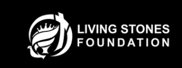

# CultiveConnect MVP  
### Senior Capstone Project · Purdue University  
**Taemoor Hasan**



---

## Overview
**CultiveConnect MVP** is my senior capstone project for **Purdue University**. It was developed in connection with the **Living Stones Foundation** and supports the broader CultiveConnect initiative, which aims to help Latin American producers better understand export readiness for the **United States** and **Canada**.

This project turns complex trade and compliance requirements into a working technical prototype that helps producers track documents, understand tariff rules, and identify missing export requirements.

https://livingstonesglobal.org/cultiveconnect/

https://livingstonesglobal.online/cultiveconnect/#dashboard 

**Live Demo:** http://localhost:5173/


---

## My Role
I contributed to this project through a mix of **software engineering**, **data engineering**, and **data analyst** work.

- **Software Engineering:** built the compliance engine, dashboard logic, bilingual translation workflow, PDF report generation, and export readiness interface  
- **Data Engineering:** structured the regulatory source-of-truth database in JSON and organized product, tariff, and compliance data into a usable system  
- **Data Analyst Work:** researched HTS / HS codes, duties, document requirements, and seasonal trade rules, then translated that research into actionable logic and validation outputs  

---

## What the System Does
- stores regulatory rules by **country** and **product**
- translates Spanish document filenames into English compliance terms
- compares uploaded files against required documents
- checks **seasonal tariff windows** for products like grapes and asparagus
- generates a clear **gap analysis** and export readiness result
- creates a **PDF compliance gap report** that can be opened from the frontend

---

## Tech Stack
- **Python**
- **JSON**
- **React + Vite**
- **Frontend dashboard UI**
- **Rule-based compliance engine**
- **Mock PDF testing suite**
- **FPDF PDF report generation**

---

## Project Structure
```text
backend/
  compliance_engine.py
  generate_pdf_report.py
  translation_map.py
  data/regulations.json
  mock_uploads/
  validation_report.txt

frontend/
  public/
    Compliance_Gap_Report.pdf
  src/
    App.jsx
    assets/
      living-stones-logo.png
```

---

## How to Run

### Backend
```bash
cd backend
python compliance_engine.py
```

This runs the compliance engine, scans the mock uploads, checks seasonal tariff logic, and generates the validation report.

### Generate PDF Report
```bash
cd backend
python generate_pdf_report.py
```

This generates the PDF report and saves it here:

```text
frontend/public/Compliance_Gap_Report.pdf
```

The frontend can open this file at:

```text
/Compliance_Gap_Report.pdf
```

### Frontend
```bash
cd frontend
npm install
npm run dev
```

Then open the local development link shown in the terminal.

The dashboard includes a **View Compliance Gap Report** button that opens the generated PDF.

---

## PDF Report Workflow
The backend runs the compliance tests, then `generate_pdf_report.py` creates a readable PDF report from the gap analysis results. The PDF is saved inside the frontend `public` folder so the React dashboard can access it directly.

```text
Backend compliance tests
        ↓
generate_pdf_report.py
        ↓
Compliance_Gap_Report.pdf
        ↓
frontend/public/
        ↓
React dashboard button
```

---

## Capstone Purpose
This capstone demonstrates how computer science can be applied to a real-world international trade problem. The project combines **structured data**, **business rules**, **bilingual validation**, **PDF reporting**, and **user-facing software design** into one working MVP.

---

## Organization Context
**Living Stones Foundation** supported this project through the CultiveConnect initiative. The larger mission is to reduce barriers for agricultural producers by making export compliance and documentation workflows more understandable and accessible.

---

## Author
**Taemoor Hasan**  
Purdue University  
Senior Capstone Project
